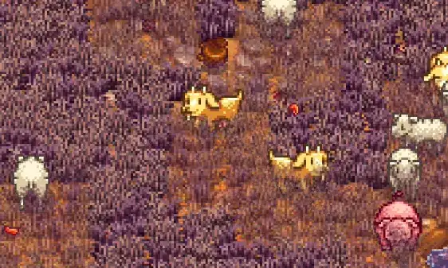

# What's in the Grass?

Fades tall grass that hides forage and farm animals, so truffles and your animals stay visible.

## Install

1. Install [SMAPI](https://smapi.io).
2. Download the latest release and unzip it into `Stardew Valley/Mods`.
3. Run the game using SMAPI.

## Compatibility

- [Generic Mod Config Menu](https://www.nexusmods.com/stardewvalley/mods/5098)
- [More Grass](https://www.nexusmods.com/stardewvalley/mods/5398)
- [Launcher Drawer](https://www.nexusmods.com/stardewvalley/mods/48269)
